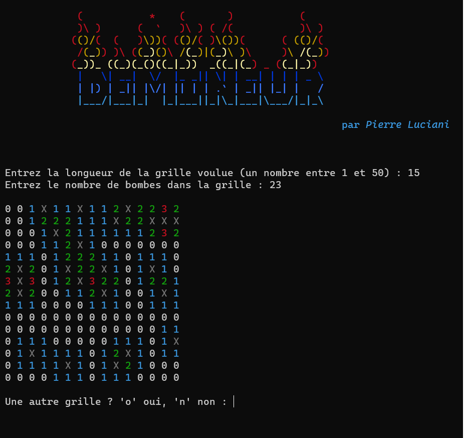

## Le Démineur

Projet personnel d'affichage d'une grille complète et colorisée du jeu du démineur en langage Python, à lancer sur le terminal.

>Nécéssite Python version 3.10 minimum pour faire fonctionner le module "colorist" qui permet de coloriser le rendu sur le termeinal.

>Installez le module "colorist" avec la commande `pip3 install colorist`

Exemples:

